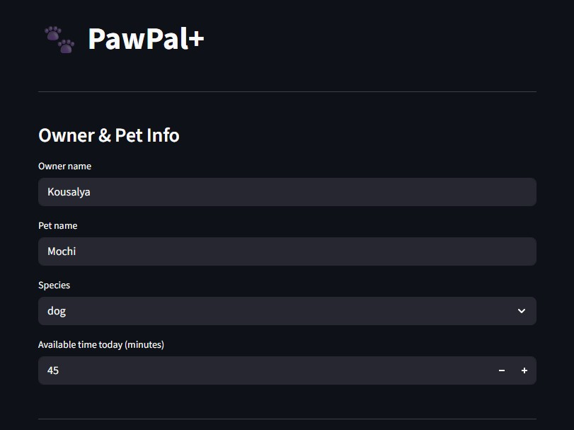
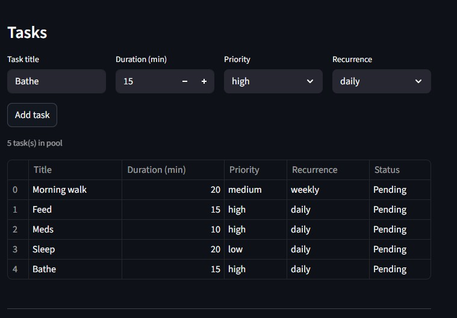
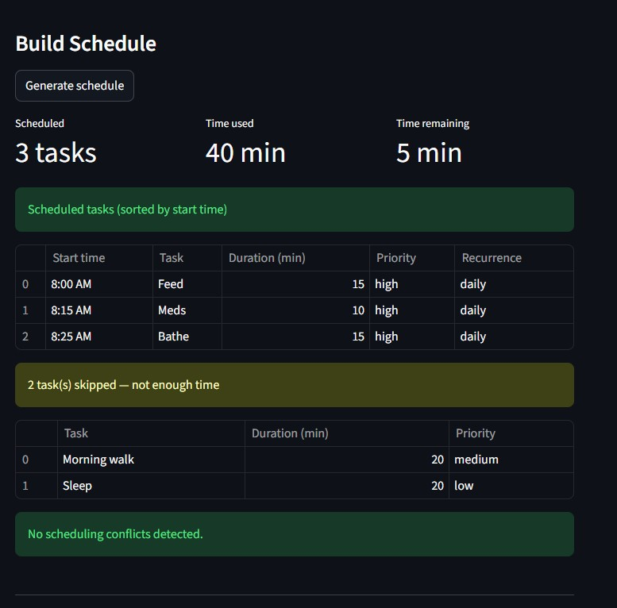
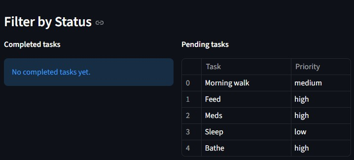
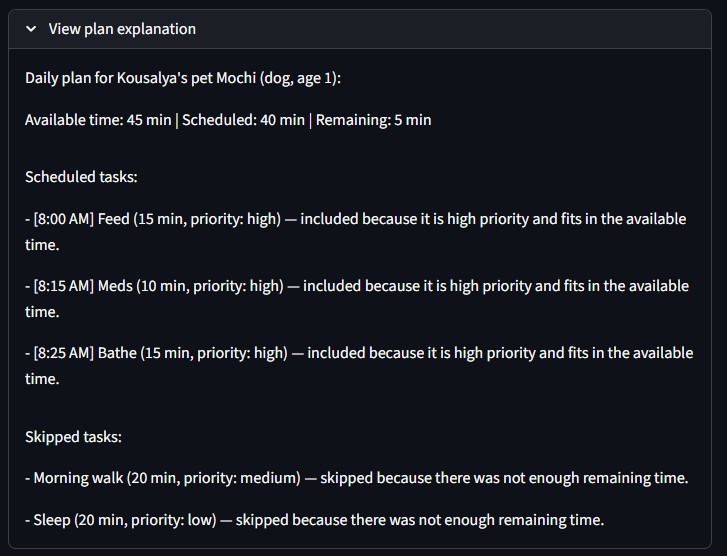

# PawPal+ (Module 2 Project)

## Demo

### Owner & Pet Setup


### Task Pool with Recurrence


### Generated Schedule with Skipped Tasks & Conflict Check


### Filter by Completion Status


### Plan Explanation Expander


---

## Features

- **Priority-based scheduling** — Tasks are sorted by priority (`high → medium → low`) using a greedy algorithm. The scheduler fits as many tasks as possible into the owner's available time, always placing higher-priority tasks first.
- **Time budgeting** — Tasks that exceed the remaining time budget are automatically moved to a skipped list rather than dropped silently, so the user can see exactly what didn't fit and why.
- **Start time assignment** — Each scheduled task is assigned a human-readable start time (e.g., `"8:30 AM"`) calculated by accumulating durations sequentially from a fixed day-start of 8:00 AM.
- **Sorting by time** — `sort_by_time()` reorders the scheduled task list chronologically. Time strings are parsed back into integer minutes for reliable numeric comparison, then the list is sorted in-place.
- **Filtering by completion** — `filter_by_completion(completed)` scans the full task pool and returns only tasks matching the requested status (`True` for done, `False` for pending).
- **Filtering by pet** — `filter_by_pet(pet_name)` returns the scheduler's task pool when the pet name matches, or an empty list otherwise — useful for iterating across multiple schedulers without mixing tasks between pets.
- **Daily and weekly recurrence** — Tasks marked `"daily"` or `"weekly"` automatically regenerate when completed. `complete_task()` calls `next_occurrence()` on the task, which produces a fresh copy with `completed=False` and `start_time=None`, and adds it back to the pool.
- **Same-pet conflict detection** — `detect_conflicts()` checks every pair of scheduled tasks using interval overlap logic (`a_start < b_end and b_start < a_end`). Overlapping pairs produce a named warning string instead of raising an exception.
- **Cross-pet conflict detection** — `find_cross_scheduler_conflicts(schedulers)` applies the same interval check across all tasks from multiple schedulers, flagging cases where two pets would require the owner's attention at the same time.
- **Plan explanation** — `explain_plan()` returns a human-readable list of strings describing why each task was scheduled or skipped, including time budget totals.


You are building **PawPal+**, a Streamlit app that helps a pet owner plan care tasks for their pet.

## Scenario

A busy pet owner needs help staying consistent with pet care. They want an assistant that can:

- Track pet care tasks (walks, feeding, meds, enrichment, grooming, etc.)
- Consider constraints (time available, priority, owner preferences)
- Produce a daily plan and explain why it chose that plan

Your job is to design the system first (UML), then implement the logic in Python, then connect it to the Streamlit UI.

## What you will build

Your final app should:

- Let a user enter basic owner + pet info
- Let a user add/edit tasks (duration + priority at minimum)
- Generate a daily schedule/plan based on constraints and priorities
- Display the plan clearly (and ideally explain the reasoning)
- Include tests for the most important scheduling behaviors

## Smarter Scheduling

Beyond the core daily planner, the following features were added to make the scheduler more realistic and robust.

**Task recurrence** — Tasks can be marked as `"daily"` or `"weekly"`. When `Scheduler.complete_task()` is called on a recurring task, a fresh copy is automatically added back to the task pool for the next occurrence. Non-recurring tasks are completed and removed with no side effects.

**Sorting by time** — `Scheduler.sort_by_time()` reorders the scheduled task list chronologically by start time. This is useful when start times are adjusted manually outside of `build_schedule()`.

**Filtering** — `Scheduler.filter_by_completion(completed)` returns all tasks that match a given completion status (`True` for done, `False` for pending). `Scheduler.filter_by_pet(pet_name)` returns the full task pool if the scheduler's pet matches the given name, or an empty list otherwise — useful when iterating across multiple schedulers.

**Conflict detection** — `Scheduler.detect_conflicts()` checks a single pet's scheduled tasks for time overlaps and returns human-readable warning strings without crashing. `find_cross_scheduler_conflicts(schedulers)` performs the same check across multiple schedulers, flagging cases where two pets would require the owner's attention at the same time.

## Testing PawPal+

### Running the tests

```bash
python -m pytest tests/test_pawpal.py -v
```

### What the tests cover

The test suite contains **22 tests** organized across five areas:

| Area | What is verified |
|---|---|
| **Happy path — scheduling** | Tasks that fit are scheduled with a start time assigned; tasks that exceed the budget land in `skipped_tasks`; a task whose duration exactly equals the budget is included (boundary condition) |
| **Edge cases — empty/zero inputs** | No tasks produces an empty schedule without crashing; `available_minutes=0` skips every task; a scheduler with a single task detects no conflicts |
| **Sorting correctness** | `sort_by_time()` returns tasks in ascending chronological order regardless of insertion order; `build_schedule()` schedules high-priority tasks before lower-priority ones when time is limited |
| **Recurrence logic** | Completing a `daily` or `weekly` task adds exactly one fresh task (uncompleted, no start time) to the pool; completing the same task twice grows the pool by exactly two, not exponentially; completing a non-recurring task leaves the pool unchanged |
| **Conflict detection** | Overlapping same-pet tasks produce a named warning; two tasks at the exact same start time are flagged; non-overlapping tasks produce no warnings; `find_cross_scheduler_conflicts()` catches cross-pet overlaps and clears when tasks are separated |

### Confidence level

**4 / 5 stars**

The core scheduling contract — priority ordering, time budgeting, recurrence regeneration, and overlap detection — is fully exercised and all 22 tests pass. One star is held back because the 12-hour clock parser (`_time_str_to_minutes`) is not directly unit-tested for midnight/noon edge cases, and `sort_by_time()` maps `start_time=None` to midnight (0 min) rather than raising an error, which could silently misorder tasks if a task is sorted before its start time is assigned.

---

## Getting started

### Setup

```bash
python -m venv .venv
source .venv/bin/activate  # Windows: .venv\Scripts\activate
pip install -r requirements.txt
```

### Suggested workflow

1. Read the scenario carefully and identify requirements and edge cases.
2. Draft a UML diagram (classes, attributes, methods, relationships).
3. Convert UML into Python class stubs (no logic yet).
4. Implement scheduling logic in small increments.
5. Add tests to verify key behaviors.
6. Connect your logic to the Streamlit UI in `app.py`.
7. Refine UML so it matches what you actually built.
